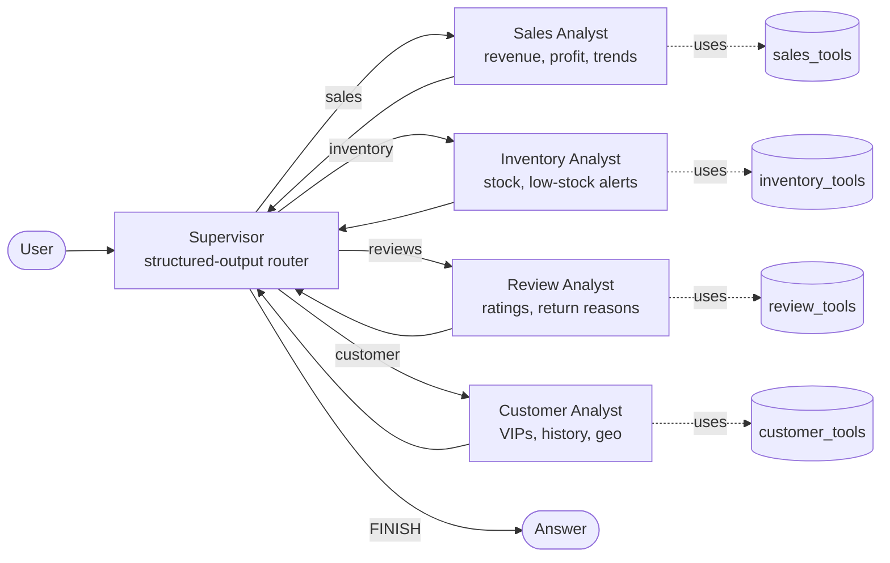

# agentstore

**A multi-agent e-commerce assistant built on LangGraph and Claude.**

`agentstore` turns natural-language questions about a retail business —
revenue, inventory, customer reviews, top spenders — into accurate,
tool-grounded answers. A *supervisor* agent routes each question to one of
four specialist agents, each with its own focused toolset against the
store's data.

[](https://github.com/devthedevil/agentstore/actions/workflows/ci.yml)


---

## Why this exists

Most LangGraph tutorials show a single ReAct agent or a toy two-node graph.
Real systems usually want **specialist agents with narrow toolsets** routed
by a **supervisor** — better grounding, simpler prompts, easier debugging.
`agentstore` is a clean, production-shaped reference implementation of that
pattern over a concrete domain (e-commerce analytics) so you can fork it
and swap in your own data and tools.

## Architecture



### Key design choices

| Choice | Why |
|---|---|
| **Supervisor uses `with_structured_output`** | Routing is enum-constrained Pydantic — the LLM physically cannot return a free-form string, so the graph never wedges on an unknown destination. |
| **Each specialist owns its toolset** | Smaller prompts, fewer tool-selection mistakes, cleaner ownership. Add a tool to `tools/sales_tools.py` and only the sales agent sees it. |
| **`RECURSION_LIMIT = 8`** | Hard cap on supervisor↔worker hops per request — bounds cost and latency even if the LLM keeps trying to re-route. |
| **`@lru_cache` on data loaders** | The JSON dataset loads once per process; tests can call `data.reset_cache()` to mutate fixtures cleanly. |
| **No DB in the demo** | Easier to fork and adapt. Real deployments should swap `agentstore/data.py` for a database client; nothing else changes. |

## Quickstart

```bash
git clone https://github.com/devthedevil/agentstore.git
cd agentstore

python -m venv .venv && source .venv/bin/activate
pip install -e ".[dev]"

cp .env.example .env
# Edit .env and set ANTHROPIC_API_KEY=sk-ant-...

# CLI smoke test
python -m agentstore.cli "What were our total sales and profit?"

# Or run the server + UI
uvicorn agentstore.server:app --reload --port 8000
# open http://localhost:8000
```

### Docker

```bash
docker build -t agentstore .
docker run --rm -p 8000:8000 \
  -e ANTHROPIC_API_KEY=sk-ant-... \
  agentstore
```

## Try these queries

| Question | Routes to |
|---|---|
| *What was our total revenue and profit margin?* | sales |
| *Which products are running low on stock?* | inventory |
| *What are the top 3 reasons customers return items?* | reviews |
| *Who are our top 5 customers by spend?* | customer |
| *Which category sold the most in the last 12 months?* | sales |
| *Tell me about customer #1's order history* | customer |

## Project layout

```
agentstore/
├── agentstore/
│   ├── config.py        # Env-loaded Settings, lazy singleton
│   ├── llm.py           # ChatAnthropic factory (cached)
│   ├── data.py          # Demo dataset loaders + lookup helpers
│   ├── state.py         # TypedDict graph state schema
│   ├── supervisor.py    # Routing node + conditional-edge function
│   ├── graph.py         # StateGraph wiring + compile
│   ├── server.py        # FastAPI app: /api/chat, /api/health, /
│   ├── cli.py           # `python -m agentstore.cli "..."`
│   ├── agents/          # 4 specialist worker agents
│   │   ├── _factory.py  # Shared ReAct → graph-node builder
│   │   ├── sales.py
│   │   ├── inventory.py
│   │   ├── reviews.py
│   │   └── customer.py
│   └── tools/           # Tools grouped by specialist
│       ├── sales_tools.py
│       ├── inventory_tools.py
│       ├── review_tools.py
│       └── customer_tools.py
├── data/                # Demo e-commerce dataset (JSON)
├── frontend/index.html  # Single-page chat UI (no build step)
├── tests/               # Unit + topology + HTTP tests
├── Dockerfile
├── pyproject.toml
└── requirements.txt
```

## Extending agentstore

### Add a new specialist agent

1. Create `agentstore/tools/<domain>_tools.py` — a list of `@tool`-decorated
   functions and export `XYZ_TOOLS`.
2. Create `agentstore/agents/<domain>.py` — call `build_worker(name, system_prompt, XYZ_TOOLS)`.
3. Add the name to `AgentName` in `agentstore/state.py`.
4. Register the node in `agentstore/graph.py` and add it to the conditional-edge map.
5. Mention the new specialist in `supervisor.py`'s `SUPERVISOR_PROMPT`.

### Swap the dataset for a database

Replace the loader functions in `agentstore/data.py` (e.g. `products()`,
`orders()`) with calls to your DB client. Tools call only those accessors,
so nothing else has to change.

### Swap Claude for another LLM

Edit `agentstore/llm.py` to return a different LangChain `BaseChatModel`.
Every agent and the supervisor go through that single factory, so the
swap is a one-file change. Worth noting: the supervisor relies on
`with_structured_output(Route)`, so the chosen model must support
structured output (most current LLMs do via LangChain).

## Development

```bash
pip install -e ".[dev]"
ruff check agentstore tests       # lint
pytest                            # run tests
pytest --cov=agentstore           # with coverage
```

The CI workflow ([`.github/workflows/ci.yml`](.github/workflows/ci.yml))
runs lint + tests against Python 3.11 and 3.12 on every push and PR.

## License

MIT — see [LICENSE](LICENSE).

## Acknowledgements

- [LangGraph](https://langchain-ai.github.io/langgraph/) for the graph runtime.
- [Anthropic Claude](https://www.anthropic.com/claude) for the underlying LLM.
- Demo dataset adapted from a sibling project (AskMyStore).
